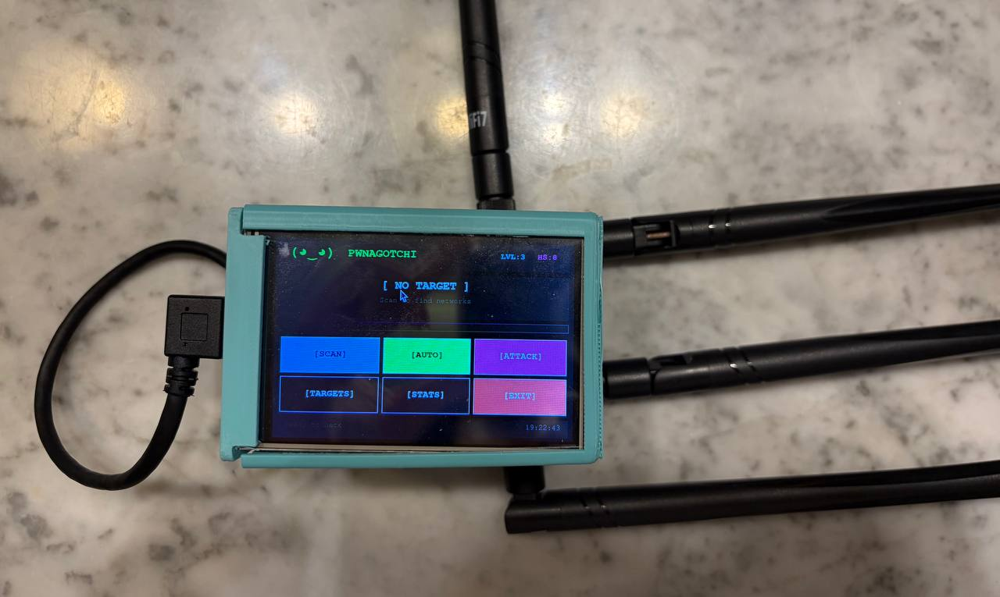

# Camelgotchi


A portable WiFi security testing tool inspired by [Pwnagotchi](https://pwnagotchi.ai/), built for Raspberry Pi 4B. Unlike the original Pwnagotchi which only works on 2.4GHz, this supports both 2.4GHz and 5GHz networks using an external adapter.

Built as a wireless security course project.

## What it does

- Scans for nearby WiFi networks (2.4GHz and 5GHz)
- Captures WPA2 handshakes via deauthentication attacks
- Uses Q-learning to pick attack strategies based on signal strength
- Runs on a 3.5" touchscreen with a Pwnagotchi-style ASCII face UI
- Auto mode for continuous scan-and-attack cycles
- Tracks stats (handshakes captured, level, XP) in a local SQLite database

## Hardware

- Raspberry Pi 4B
- 3.5" SPI TFT Touchscreen (480x320)
- Alfa AWUS1900 USB WiFi Adapter (for monitor mode + 5GHz)
- PiSugar 3 Plus 5000mAh UPS (optional, for portable use)
- 3D printed case (STL files in `case/`)

## Setup

```bash
# Install dependencies
sudo apt install aircrack-ng reaver python3-tk

# Clone the repo
git clone https://github.com/lamaAlshuhail/camelgotchi.git
cd camelgotchi

# Run (requires root for monitor mode)
sudo python3 camelgotchi.py
```

If running over SSH/VNC:
```bash
DISPLAY=:0 xhost +local:root
sudo DISPLAY=:0 python3 camelgotchi.py
```

## Configuration

Edit the `CONFIG` dict at the top of `camelgotchi.py`:

- `interface` - your monitor-capable WiFi adapter (check with `iw dev`)
- `captures_dir` - where .cap files get saved
- `authorized_networks` - whitelist of networks you're allowed to test

## 3D Printed Case

STL files for a modified Raspberry Pi 4B case that fits the 3.5" touchscreen and PiSugar 3 Plus battery underneath. Based on [this Printables model](https://www.printables.com/model/997774-raspberry-pi-4-case-with-35-touchscreen-files), with the bottom walls extended by 17mm.

- `rpi4B_case_extended_modified.stl` - Main case body
- `cover_v3_raised_screen_updated_adjusted_nut_holders.stl` - Sliding cover

Print settings: 0.20mm layer height, 15-20% infill, supports recommended.

## Disclaimer

This tool is for authorized security testing only. Only use it on networks you own or have explicit permission to test. Unauthorized access to computer networks is illegal.
